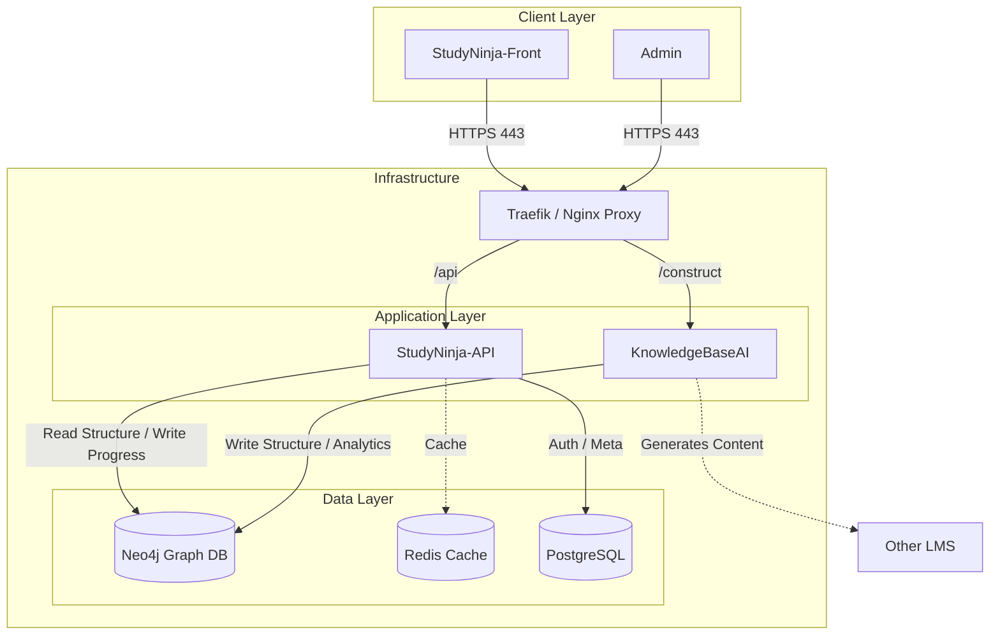

`KnowledgeBaseAI` концептуально выделен не просто как "админка", а как **платформа-контруктор**, меняет парадигму проекта с *продуктовой* (просто сайт репетитор) на *платформенную* (движок для создания умных образовательных систем).

Ниже представлено **Видение (Vision)** и детальная **Архитектура** экосистемы, развернутой на инфраструктуре `XTeam.Pro`.

***

### 1. Глобальное Видение: "Knowledge OS" (Операционная система знаний)

Проект следует рассматривать не как один сайт StudyNinja, а как двухуровневую систему:

1. **Level 1: The Engine (KnowledgeBaseAI)** — Это технологическое ядро, "WordPress для образования 3.0". Это среда разработки образовательного контента, где методисты строят графы связей, не думая о фронтенде. В будущем этот компонент продается корпорациям, университетам и школам как инструмент для создания их собственных адаптивных курсов.
2. **Level 2: The Implementation (StudyNinja)** — Это *первый дистрибутив* этой системы. Демонстрация возможностей движка на примере школьной программы (ЕГЭ/ОГЭ).

**Миссия:** Переход от линейного обучения (список видеоуроков) к нелинейному, графовому, который адаптируется под мышление конкретного человека.

***

### 2. Структура и Архитектура Экосистемы

Инфраструктура на `XTeam.Pro` объединяет все три репозитория в единый кластер. Используется паттерн **Service-Oriented Architecture (SOA)**.

#### Схема взаимодействия компонентов

***

#### Разбор компонентов и их роль в будущем

#### 1. KnowledgeBaseAI (The Core / The Factory)

**Роль сейчас:** Инструмент для создания графа StudyNinja.
**Роль в будущем:** SaaS-платформа (Graph CMS) для проектирования образовательных систем.

* **Функционал:**

  * Визуальный редактор графа (Nodes: Topics, Skills; Edges: Prereqs).

  * Инструменты AI-генерации (LLM строит связи между темами автоматически).

  * Аналитика целостности ("Есть ли разрывы в обучении?").

* **Техническое развитие:** Необходимо развивать API для экспорта графов, чтобы другие компании могли подключать этот "движок" к своим фронтендам.

#### 2. StudyNinja-API (The Brain / The Integration Hub)

**Роль:** Оркестратор бизнес-процессов.

* **Функционал:**

  * **Authentication Service:** Единый вход (SSO).

  * **Adaptivity Engine:** Алгоритм, который решает: "Какой следующий шаг предложить ученику на основе графа из базы?".

  * **Payment & Subscriptions:** Логика монетизации.

* **Техническое развитие:** Переход на микросервисы (отдельно сервис Auth, отдельно сервис Recommendation). Внедрение GraphQL, чтобы фронтенд мог гибко запрашивать куски графа.

#### 3. StudyNinja-Front (The Interface)

**Роль:** Клиентский терминал.

* **Функционал:** Максимально легкий SPA/PWA. Он не принимает решений, он только отображает граф и отправляет ответы пользователя.

* **UX Будущего:** "Живая карта". Интерфейс должен напоминать стратегическую игру (дерево технологий в Civilization), где открытие нового навыка дает дофаминовое подкрепление.

***

### 3. Инфраструктурный Дизайн (XTeam.Pro)

Развертывание на одном домене с разными портами/путями — отличная стратегия для старта, упрощающая CORS и SSL.

* **Entry Point (Traefik/Nginx):**

  * `studyninja.ru` (или основной домен) -> Направляет на **StudyNinja-Front**.

  * `api.studyninja.ru` -> Направляет на **StudyNinja-API**.

  * `kb.studyninja.ru`  -> Направляет на **KnowledgeBaseAI**. Это зона для администраторов и методистов.

* **База данных (Neo4j):** Является "общим знаменателем".

  * `KnowledgeBaseAI` имеет права **READ/WRITE** на структуру графа (узлы и связи контента).

  * `StudyNinja-API` имеет права **READ** на структуру и **WRITE** на *связи прогресса* (User Progress Edges).

  * Это гарантирует, что пользовательский трафик не сломает структуру курса.

### 4. Стратегия масштабирования (Roadmap to Future)

1. **Мультитенантность (Multi-tenancy):**
   В базу Neo4j добавляется лейбл `Tenant` (например, "School\_A", "University\_B"). Платформа `KnowledgeBaseAI` позволяет создавать изолированные вселенные знаний для разных заказчиков на одной инфраструктуре.

2. **LLM Integration (AI-Tutor):**
   В `StudyNinja-API` добавляется слой с OpenAI/Llama. Когда ученик застревает на узле графа, он чатится не с живым человеком, а с ботом, у которого в контексте загружено описание именно этого узла из `KnowledgeBaseAI`.

3. **Федеративное обучение:**
   Если `KnowledgeBaseAI` станет стандартом, можно будет обмениваться подграфами. Например, "Граф Математики" от StudyNinja импортируется в корпоративный университет банка для обучения аналитиков.

### Итог

У вас на руках **полный цикл EdTech-производства**:

1. **Станок (KnowledgeBaseAI)** — производит знание.
2. **Движок (API)** — делает знание адаптивным.
3. **Витрина (Front)** — продает знание пользователю.

Разделение на три репозитория — единственно верное решение для такой амбициозной цели. Это позволяет обновлять логику обучения (API), не ломая интерфейс (Front) и не переписывая базу знаний (KB).
