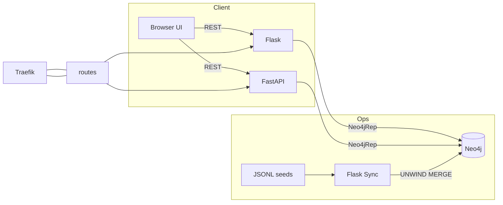
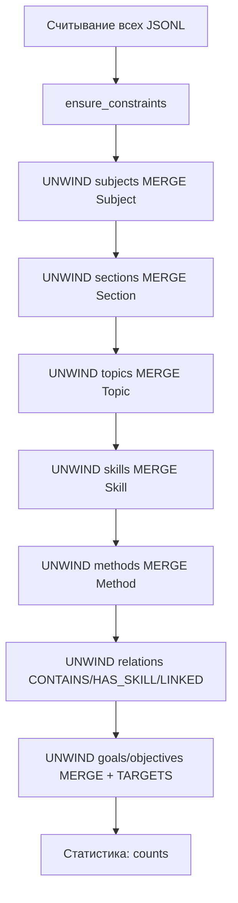
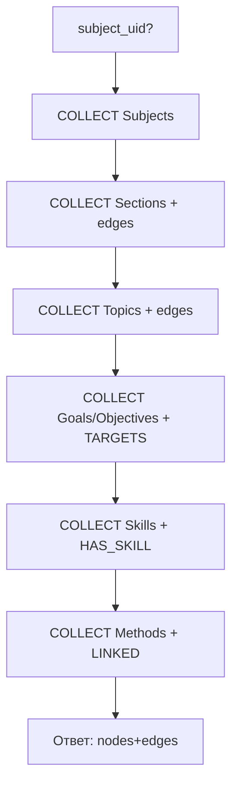

# KnowledgeBaseAI — Архитектура, алгоритмы и примеры использования

## 1. Архитектурный обзор
- Компоненты:
  - **Neo4j** — граф знаний, индексы/констрейнты, хранение узлов/связей и пользовательских прогрессов.
  - **Flask** (`web_app.py`) — UI, сервисные API: визуализация графа, аналитика, нормализация JSONL, синхронизация, CRUD, списки/детали, Swagger.
  - **FastAPI** (`fastapi_app.py`) — тестирование и персонализация: обновление динамичных весов, пользовательские уровни, адаптивные дорожные карты, точечный пересчёт связей, фиксация завершений.
  - **Neo4jRepo** (`neo4j_repo.py`) — единый слой доступа к Neo4j (read/write, батчевый UNWIND, ретраи).
  - **UI (Cytoscape)** (`static/js/knowledge.js`) — визуализация с фильтрами, поиском, порогом степени и панелью деталей.
  - **Traefik + Docker Compose** — маршрутизация HTTP/HTTPS, автосертификаты Let’s Encrypt, контейнеризация.



## 2. Модель данных и индексы
- Узлы: `Subject`, `Section`, `Topic`, `Skill`, `Method`, `Goal`, `Objective`, `User`.
- Связи:
  - Subject `CONTAINS`→ Section; Section `CONTAINS`→ Topic
  - Subject `HAS_SKILL`→ Skill; Skill `LINKED`→ Method (`weight`, `confidence`, `adaptive_weight`)
  - Topic `TARGETS`→ Goal|Objective; Topic `PREREQ`→ Topic
  - User `PROGRESS_TOPIC`→ Topic; User `PROGRESS_SKILL`→ Skill; User `COMPLETED`→ Topic|Skill
- Индексы/констрейнты:
  - Уникальность `uid` на всех типах
  - Уникальность `(subject_uid,title)` для Section; `(section_uid,title)` для Topic; `(subject_uid,title)` для Skill
  - Индексы `title` (Subject/Section/Topic/Skill/Method) для поиска

## 3. Алгоритмы и блок‑схемы

### 3.1 Нормализация JSONL
- Цели: правка склейки строк, дедупликация, проверка UID/префиксов/ссылок, отчёт `invalid/warnings`.
```mermaid
flowchart TD
  N0[Вход: файл JSONL] --> N1{есть склейка '}{' ?}
  N1 --да--> N2[Заменить на '}'\n'{']
  N1 --нет--> N3
  N2 --> N3[Парсинг строк → JSON]
  N3 --> N4{Валидна схема?}
  N4 --нет--> N5[Добавить в invalid]
  N4 --да--> N6[Проверить префикс UID/суффикс]
  N6 --нет--> N5
  N6 --да--> N7[Проверка ссылочных полей]
  N7 --нет--> N5
  N7 --да--> N8[Дедупликация по uid/паре]
  N8 --> N9[Запись валидных ← отчёт invalid/warnings]
```

### 3.2 Синхронизация в Neo4j
- Батчевый UNWIND MERGE узлов/связей; констрейнты и индексы применяются заранее.


### 3.3 Построение графа для визуализации
- Один запрос Cypher с `COLLECT()`.


### 3.4 Обновление динамичных весов
- Глобально или для пользователя; точечный пересчёт `adaptive_weight` для связей изменённого навыка.
```mermaid
flowchart TD
  W0[вход: score] --> W1[delta=(50-score)/100]
  W1 --> W2{Topic?
  Skill?}
  W2 --Topic--> W3[SET t.dynamic_weight ← clamp(cur+delta)]
  W2 --Skill--> W4[SET s.dynamic_weight ← clamp(cur+delta)]
  W4 --> W5[RECOMPUTE s-[:LINKED]->m adaptive_weight]
  W3 --> W6[Ответ: обновлённый вес]
  W5 --> W6
```

### 3.5 Пользовательская дорожная карта
- Взвешивание тем по персональному/глобальному `dynamic_weight`, с учётом штрафа за незакрытые пререквизиты.
```mermaid
flowchart TD
  R0[user_id, subject_uid?, limit, penalty_factor] --> R1[Собрать темы + пользовательские веса]
  R1 --> R2[Найти PREREQ для каждой темы]
  R2 --> R3[missing = count(prereq weight > 0.3)]
  R3 --> R4[effective_dw = dw - penalty_factor*missing]
  R4 --> R5[Сортировка по effective_dw]
  R5 --> R6[Подбор skills/methods с учётом весов]
  R6 --> R7[Ответ: список с приоритетом, skills, methods]
```

### 3.6 Поиск
- Поиск по `title` в любых узлах.
```mermaid
flowchart TD
  Q0[q, limit] --> Q1[MATCH (n) WHERE toLower(n.title) CONTAINS toLower(q)]
  Q1 --> Q2[RETURN uid, type, title LIMIT]
```

## 4. Жизненный цикл запросов
- Flask UI (`/knowledge`) → `GET /api/graph` → рисует граф, фильтры/поиск/детали по клику.
- Нормализация/синхронизация (кнопки) → `POST /api/normalize_kb`, `POST /api/neo4j_sync`.
- Аналитика → `GET /api/analysis`.
- Списки/детали → `GET /api/list`, `GET /api/node_details`.
- FastAPI тесты/персонализация → `POST /test_result`, `POST /skill_test_result`, `POST /user/roadmap`, `POST /user/complete_*`.

## 5. API: примеры использования

### 5.1 Тестирование уровня знаний
- Обновление динамичного веса темы (персонально):
```bash
curl -X POST http://api.kb.<domain>/test_result \
  -H 'Content-Type: application/json' \
  -d '{"user_id":"user-001","topic_uid":"TOP-ALG-QUAD-EQ","score":42}'
```
- Обновление динамичного веса навыка:
```bash
curl -X POST http://api.kb.<domain>/skill_test_result \
  -H 'Content-Type: application/json' \
  -d '{"user_id":"user-001","skill_uid":"SKL-QUAD-FORMULA","score":80}'
```
- Получение пользовательского уровня:
```bash
curl http://api.kb.<domain>/user/knowledge_level/user-001/TOP-ALG-QUAD-EQ
curl http://api.kb.<domain>/user/skill_level/user-001/SKL-QUAD-FORMULA
```

### 5.2 Персонализированная дорожная карта
- С составным учётом пререквизитов:
```bash
curl -X POST http://api.kb.<domain>/user/roadmap \
  -H 'Content-Type: application/json' \
  -d '{"user_id":"user-001","subject_uid":"SUB-MATH","limit":50,"penalty_factor":0.15}'
```
- Глобальная карта:
```bash
curl -X POST http://api.kb.<domain>/roadmap -H 'Content-Type: application/json' -d '{"subject_uid":"SUB-MATH","limit":50}'
```

### 5.3 Фиксация завершений
```bash
curl -X POST http://api.kb.<domain>/user/complete_topic \
  -H 'Content-Type: application/json' \
  -d '{"user_id":"user-001","topic_uid":"TOP-ALG-QUAD-EQ","time_spent_sec":1200,"errors":1}'
```
```bash
curl -X POST http://api.kb.<domain>/user/complete_skill \
  -H 'Content-Type: application/json' \
  -d '{"user_id":"user-001","skill_uid":"SKL-QUAD-FORMULA","time_spent_sec":900,"errors":0}'
```

### 5.4 Нормализация и синхронизация
- Нормализация сидов (требует `X-API-Key`):
```bash
curl -X POST http://kb.<domain>/api/normalize_kb -H 'X-API-Key: <ADMIN_API_KEY>'
```
- Синхронизация в Neo4j:
```bash
curl -X POST http://kb.<domain>/api/neo4j_sync -H 'X-API-Key: <ADMIN_API_KEY>'
```

### 5.5 Визуализация и поиск
- Визуализация: `http://kb.<domain>/knowledge`
- Поиск узлов:
```bash
curl 'http://kb.<domain>/api/search?q=квадрат&limit=20'
```

## 6. Паттерны и лучшие практики
- **Доступ к БД**: Используйте `Neo4jRepo` (`read`, `write`, `write_unwind`), не ходите напрямую через сессии за пределами слоя.
- **Батчи**: UNWIND с размером партии ~500; аггрегация `COLLECT()` для графа.
- **Персонализация**: отделяйте глобальные и пользовательские веса; точечно пересчитывайте связи навыков.
- **Валидация сидов**: нормализуйте перед синхронизацией; проверяйте UID префиксы/суффиксы.
- **UI**: скрывайте метки на малом зуме; добавляйте фильтры и пороги.
- **Безопасность**: не коммитьте секреты; защищайте мутационные эндпоинты `X-API-Key`.

## 7. Тестирование
- **Модульные**: нормализация JSONL (валидация, отчёт); вычисление `effective_dynamic_weight`.
- **Интеграционные**: синхронизация → выборки из Neo4j; обновление весов → пересчёт `adaptive_weight`.
- **UI e2e**: проверка фильтров, поиска, детализации по клику.

## 8. Траблшутинг
- **404 /api/docs (Flask)**: перезапустить Flask/Traefik; проверить маршруты Host в labels.
- **LE/HTTPS**: добавить A‑записи для `kb.*` и `api.kb.*`; перезапустить Traefik.
- **Neo4j ResultConsumed**: читать результаты строго внутри транзакции (см. `neo4j_repo.read`).

## 9. Расширение
- Добавить `response_model` и примеры в Swagger FastAPI/Flask.
- Улучшить эвристику статичных весов (TF‑IDF/словари).
- Включить планировщик еженедельной нормализации/синхронизации (host cron/воркер).

