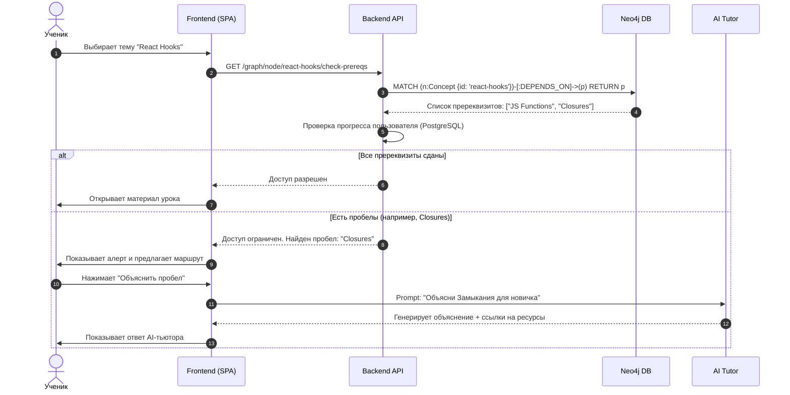
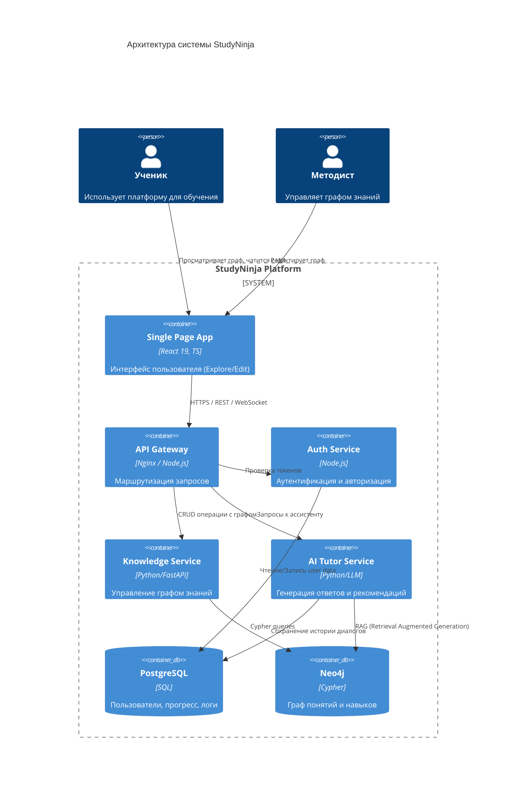
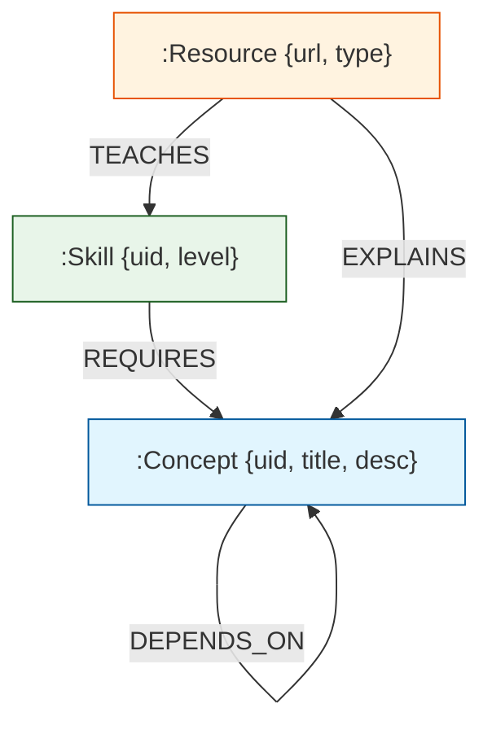

# ОТЧЕТ О ПРОХОЖДЕНИИ ПРАКТИКИ / ВЫПОЛНЕНИИ ВКР

**Тема:** Разработка интеллектуальной образовательной платформы "StudyNinja" с использованием графовых моделей знаний и адаптивных алгоритмов обучения.

---

## 1. Задание от предприятия

### 3. Задание от предприятия

#### 3.1 Моделирование разрабатываемой системы

В рамках выполнения задания студент занимался **моделированием системы**. Этот этап включал разработку архитектурных моделей, схем данных и диаграмм последовательности.

##### 1. Термины

*   **Граф знаний (Knowledge Graph)**: Структурированная сеть понятий и связей между ними, позволяющая системе "понимать" контекст обучения.
*   **ИИ-ассистент (AI Tutor)**: Интеллектуальный агент, использующий LLM (Large Language Models) для ответов на вопросы и генерации учебных материалов.
*   **Образовательная траектория**: Персонализированный путь изучения материала, динамически строящийся на основе текущих знаний студента.
*   **Узел (Node)**: Единица знания (понятие, навык, ресурс) в графе.

##### 2. Бизнес-требования

###### 2.1 Организация
Заказчиком выступает образовательный проект "StudyNinja", целью которого является демократизация доступа к качественному персонализированному образованию.

###### 2.2 Бизнес-задачи
*   **Повышение вовлеченности**: Увеличение времени, проводимого студентами на платформе, за счет геймификации и интерактивности.
*   **Персонализация**: Снижение оттока студентов (churn rate) путем адаптации сложности материала под каждого ученика.
*   **Масштабируемость**: Возможность поддержки тысяч одновременных пользователей и миллионов узлов в графе знаний.

###### 2.3 Анализ заинтересованных сторон
*   **Студенты**: Заинтересованы в быстром и эффективном освоении материала.
*   **Преподаватели/Методисты**: Заинтересованы в удобных инструментах для создания и редактирования курсов.
*   **Администраторы**: Заинтересованы в стабильности системы и безопасности данных.

###### 2.4 Ограничения, предположения и зависимости
*   **Ограничения**: Система должна работать в современных веб-браузерах без установки плагинов.
*   **Предположения**: Пользователи имеют стабильное интернет-соединение.
*   **Зависимости**: Работа ИИ-ассистента зависит от доступности API внешних LLM провайдеров.

###### 2.5 Роли конечных пользователей
*   **Гость**: Просмотр демо-версии графа.
*   **Студент**: Обучение, прохождение тестов, общение с ИИ.
*   **Автор курса**: Создание и редактирование узлов графа.
*   **Администратор**: Управление пользователями и системными настройками.

###### 2.6 Описание ожиданий заказчика
Заказчик ожидает получить MVP (Minimum Viable Product), демонстрирующий возможность визуализации сложных связей между темами и работу контекстного ИИ-ассистента.

###### 2.7 Анализ существующих процессов

**2.7.1 Процессы (Текущие)**
В настоящее время обучение происходит линейно: Студент -> Лекция 1 -> Лекция 2. Если студент не понял Лекцию 1, он не сможет понять Лекцию 2, но система этого не отслеживает.

**2.7.2 Карта процессов (Текущая)**
*   Студент открывает список курсов.
*   Выбирает курс.
*   Просматривает статический контент (PDF/Видео).
*   Проходит тест.
*   Получает оценку (без детального анализа пробелов).

##### 3. Требования заказчика

###### 3.1 Анализ процесса

**3.1.1 Процессы (Будущие)**
Система адаптируется: Студент -> Тема А. Если тест провален -> Система предлагает пререквизиты (Темы B и C).

**3.1.2 Карта процесса (Будущая)**

###### 3.2 Пользователи/группы пользователей

**3.2.1 Профили пользователей/группы пользователей**
*   **Новичок**: Требует пошагового руководства и простых объяснений.
*   **Продвинутый**: Ищет справочную информацию и сложные задачи.
*   **Визуал**: Предпочитает графическое представление связей (граф).

##### 4. Вариант использования (Use Cases)

1.  **Исследование графа**: Пользователь масштабирует карту знаний, кликает на узлы, видит связи.
2.  **Умный поиск**: Поиск не по ключевым словам, а по смыслу (семантический поиск).
3.  **Диалог с ментором**: Запрос "Как это связано с предыдущей темой?" обрабатывается с учетом контекста графа.

##### 5. Дополнительные требования

###### 5.1 Требования к удобству использования
*   Интуитивно понятный интерфейс (Material Design / Ant Design).
*   Время отклика интерфейса при навигации по графу < 100мс.

###### 5.2 Внешние интерфейсы
*   REST API для обмена данными.
*   WebSocket для стриминга ответов ИИ.

###### 5.3 Требования к производительности и оборудованию
*   Поддержка графов до 10 000 узлов на клиенте без лагов.
*   Сервер: 4 vCPU, 8GB RAM для обработки запросов к БД.

###### 5.4 Ограничения по архитектуре системы
*   Микросервисная архитектура для возможности независимого обновления модулей.
*   Использование Docker для контейнеризации.

##### 6. Технологический стек

*   **Frontend**: React 19, TypeScript, Vite, Vis.js (визуализация), ReactFlow (редактор).
*   **Backend**: Python (FastAPI) / Node.js.
*   **Database**: Neo4j (граф знаний), PostgreSQL (учетные записи, аналитика).

##### 7. Основные модули системы

###### 7.1 Модуль авторизации
Отвечает за регистрацию, вход пользователей и управление сессиями (JWT токены). Поддерживает ролевую модель доступа (RBAC).

###### 7.2 Модуль визуализации и навигации по графу (Explore)
*(В исходном задании: Модуль учёта поставок и разборки)*
Центральный компонент системы. Обеспечивает рендеринг интерактивного графа знаний, обработку жестов (зум, панорамирование) и физическую симуляцию связей между узлами.

###### 7.3 Модуль редактирования знаний (Editor)
*(В исходном задании: Модуль управления складом)*
Инструментарий для методистов. Позволяет добавлять новые узлы, создавать связи типов `DEPENDS_ON`, `TEACHES`, и редактировать метаданные образовательных единиц.

###### 7.4 Модуль ИИ-сопровождения (AI Tutor)
*(В исходном задании: Модуль учёта продаж)*
Сервис, интегрирующий LLM с графовой базой данных. Реализует паттерн RAG (Retrieval Augmented Generation) для генерации точных и контекстных ответов на вопросы студентов.

###### 7.5 Модуль аналитики и отчетности
Сбор и визуализация данных о прогрессе студентов: тепловые карты изученных тем, графики успеваемости и прогнозирование времени завершения курсов.

##### 8. Тестирование
*   **Unit-тестирование**: Jest/Vitest для проверки логики компонентов.
*   **E2E-тестирование**: Cypress/Playwright для проверки пользовательских сценариев.
*   **Нагрузочное тестирование**: K6 для проверки производительности API.

### 4. Выводы
В ходе выполнения работы была спроектирована и детализирована архитектура системы StudyNinja. Разработанные модели данных и процессов обеспечивают прочный фундамент для реализации адаптивной образовательной платформы.

---

## 2. Приложение. ТЕХНИЧЕСКОЕ ЗАДАНИЕ

### 1. Введение
Настоящее техническое задание распространяется на разработку образовательной платформы "StudyNinja".

### 2. Основание для разработки
Основанием для разработки является потребность в инструментах индивидуализации образования и повышении эффективности самостоятельного обучения.

### 3. Назначение и область применения
Система предназначена для использования в образовательных учреждениях, корпоративных университетах и для самообразования.

### 4. Цель и задачи разработки
Цель: Создание программного продукта для адаптивного обучения.
Задачи:
1. Реализовать хранение знаний в виде графа.
2. Создать интерфейс навигации.
3. Интегрировать ИИ-помощника.

### 5. Термины и сокращения
*   **SPA**: Single Page Application.
*   **API**: Application Programming Interface.
*   **БД**: База данных.

### 6. Требования к системе

#### 6.1. Функциональные требования

##### 6.1.1. Авторизация
Система должна позволять пользователям регистрироваться по email и паролю, а также восстанавливать доступ.

##### 6.1.2. Основные функции
*   Просмотр графа знаний.
*   Поиск узлов.
*   Чат с контекстным помощником.
*   Редактирование графа (для админов).

##### 6.1.3. UML и DFD

**Архитектура системы (C4 Container):**

**Схема данных (ERD & Graph Schema):**

#### 6.2. Нефункциональные требования

##### 6.2.1. Производительность
Отклик API не более 200мс.

##### 6.2.2. Надёжность
Доступность 99.9%. Ежедневное резервное копирование данных.

##### 6.2.3. Безопасность
Хранение паролей в хешированном виде (Argon2/Bcrypt). HTTPS шифрование.

##### 6.2.4. Интерфейс
Адаптивность под мобильные устройства и планшеты.

#### 6.3. Требования к реализации
Код должен быть написан на TypeScript (Frontend) и Python (Backend), покрыт тестами минимум на 60%.

#### 6.4. Требования к окружению
Серверная ОС: Linux (Ubuntu/Debian). Контейнеризация: Docker.

#### 6.5. Требования к тестированию
Проведение ручного и автоматизированного тестирования перед каждым релизом.

#### 6.6. Требования к установке и сопровождению
Наличие CI/CD пайплайнов для автоматического деплоя.

#### 6.7. Требования к документации
Код должен быть документирован (JSDoc/Docstrings). API описано в Swagger/OpenAPI.
