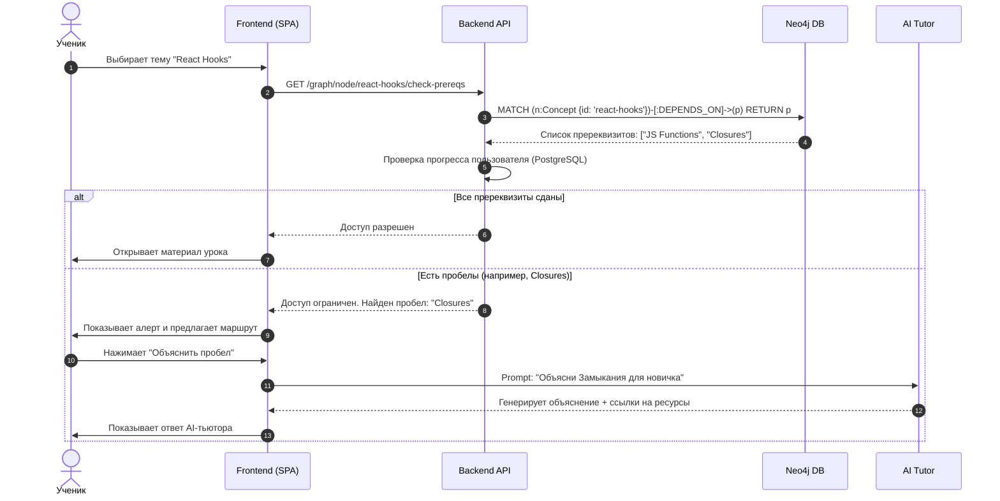

# ОТЧЕТ О ПРОХОЖДЕНИИ ПРАКТИКИ / ВЫПОЛНЕНИИ ВКР

**Тема:** Разработка интеллектуальной образовательной платформы "StudyNinja" с использованием графовых моделей знаний и адаптивных алгоритмов обучения.

---

## 1. Задание от предприятия

### 3. Задание от предприятия

#### 3.1 Моделирование разрабатываемой системы

В рамках выполнения задания студент занимался **моделированием системы**. Этот этап включал детальный анализ предметной области, разработку архитектурных моделей, проектирование схемы данных и описание сценариев взаимодействия пользователей с системой.

##### 1. Термины и Определения

*   **Граф знаний (Knowledge Graph)**: Структурированная сеть понятий (Concepts) и семантических связей между ними. В отличие от традиционных реляционных баз данных, граф позволяет системе "понимать" контекст обучения, отслеживать зависимости между темами (пререквизиты) и строить нелинейные маршруты обучения.
*   **ИИ-ассистент (AI Tutor)**: Интеллектуальный агент на базе LLM (Large Language Models), интегрированный в платформу. Он способен анализировать текущий контекст студента (изучаемый узел графа) и предоставлять персонализированные объяснения, примеры и задачи.
*   **Адаптивная образовательная траектория**: Динамический план обучения, который перестраивается в реальном времени в зависимости от успехов и неудач студента. Если студент не справляется с темой, система автоматически добавляет в траекторию необходимые для повторения базовые темы.
*   **RAG (Retrieval Augmented Generation)**: Технология генерации ответов, при которой языковая модель получает не только вопрос пользователя, но и релевантные фрагменты информации из базы знаний (графа), что минимизирует вероятность фактических ошибок ("галлюцинаций").

##### 2. Бизнес-требования

###### 2.1 Организация
Заказчиком выступает образовательный стартап "StudyNinja", миссия которого — демократизация доступа к качественному персонализированному образованию через внедрение передовых IT-технологий. Организация стремится занять нишу между массовыми онлайн-курсами (MOOC) и индивидуальным репетиторством.

###### 2.2 Бизнес-задачи
*   **Повышение вовлеченности (Retention)**: Увеличение среднего времени сессии и возвращаемости пользователей за счет интерактивной визуализации знаний и геймификации процесса исследования графа.
*   **Снижение оттока (Churn Rate)**: Уменьшение количества студентов, бросающих обучение из-за сложности материала. Решается путем автоматического выявления пробелов в знаниях и предоставления адаптивных подсказок.
*   **Масштабируемость контента**: Создание инструментов, позволяющих методистам быстро конструировать новые курсы путем переиспользования существующих узлов графа знаний, избегая дублирования контента.

###### 2.3 Анализ заинтересованных сторон
*   **Студенты**: Основные пользователи. Их ключевая потребность — быстрое и эффективное освоение материала с минимальными затратами времени на поиск информации. Ожидают интуитивно понятный интерфейс и мгновенную обратную связь.
*   **Преподаватели и Методисты**: Отвечают за наполнение базы знаний. Заинтересованы в удобных инструментах для создания и редактирования курсов.
*   **Бизнес-администраторы**: Заинтересованы в мониторинге ключевых метрик платформы (DAU/MAU, конверсия в платные подписки) и стабильности работы системы.

###### 2.4 Ограничения, предположения и зависимости
*   **Технические ограничения**: Клиентская часть должна обеспечивать рендеринг графов до 5000 узлов без заметных задержек (60 FPS) на устройствах средней производительности. Поддержка мобильных устройств (touch-интерфейс).
*   **Предположения**: Целевая аудитория имеет базовые навыки работы с цифровыми продуктами. Доступ к интернету у пользователей стабильный (для работы WebSockets).
*   **Внешние зависимости**: Критическая зависимость от API провайдеров LLM (OpenAI/Anthropic) для работы ИИ-ассистента. Необходимость реализации механизмов Fallback и кэширования ответов.

###### 2.5 Роли конечных пользователей
*   **Гость**: Ограниченный доступ. Может просматривать структуру публичных графов в режиме "только чтение", но не имеет доступа к контенту уроков и ИИ-ассистенту.
*   **Студент**: Полный доступ к обучающим материалам. Может отслеживать свой прогресс, проходить тесты, сохранять заметки и взаимодействовать с ИИ-тютором.
*   **Автор курса (Content Creator)**: Имеет права на создание и редактирование узлов и связей в рамках своих курсов. Доступ к панели аналитики контента.
*   **Супер-Администратор**: Полный доступ к управлению пользователями, биллингу и глобальным настройкам системы.

###### 2.6 Описание ожиданий заказчика
Заказчик ожидает получить MVP (Minimum Viable Product), который демонстрирует ключевое отличие от конкурентов — **нелинейное обучение**. Система должна не просто показывать список уроков, а визуализировать связи между ними, позволяя студенту видеть "карту местности" изучаемой дисциплины. Важным требованием является интеграция ИИ, который выступает не просто как чат-бот, а как контекстный помощник, знающий, на каком узле находится студент.

###### 2.7 Анализ существующих процессов

**2.7.1 Процессы (As-Is / Как есть)**
В традиционных LMS (Learning Management Systems) процесс обучения линеен и жестко регламентирован. Студент последовательно проходит модули: Модуль 1 -> Тест -> Модуль 2. Если студент не сдал тест по Модулю 2 из-за того, что забыл материал Модуля 1, система просто блокирует доступ, не объясняя причин и не предлагая вернуться к конкретной подтеме. Это приводит к фрустрации и потере мотивации.

**2.7.2 Карта процессов (As-Is)**
1.  Студент заходит в курс.
2.  Видит линейный список уроков.
3.  Изучает видео/текст урока N.
4.  Проходит тест.
5.  Получает результат (Сдал/Не сдал).
6.  В случае неудачи вынужден самостоятельно искать информацию в предыдущих уроках или внешних источниках.

##### 3. Требования заказчика

###### 3.1 Анализ процесса (To-Be / Как будет)

**3.1.1 Процессы (To-Be)**
Новая система предлагает адаптивный подход. При входе в тему система проверяет граф зависимостей. Если пререквизиты темы не изучены или забыты (на основе кривой забывания Эббингауза), система предлагает "быстрый маршрут повторения". В случае ошибки в тесте, ИИ анализирует ответ и подсвечивает на графе конкретный узел, пробел в котором привел к ошибке.

**3.1.2 Карта процесса (To-Be)**

###### 3.2 Пользователи/группы пользователей

**3.2.1 Профили пользователей**
*   **"Исследователь" (Exploratory Learner)**: Предпочитает свободную навигацию, изучение смежных тем. Для него важна визуализация связей и возможность "перепрыгивать" между ветками графа.
*   **"Целеустремленный" (Goal-Oriented)**: Хочет получить конкретный навык в кратчайшие сроки. Для него система строит кратчайший путь (Shortest Path) в графе от текущих знаний до целевого навыка.
*   **"Визуал"**: Лучше воспринимает информацию через схемы и диаграммы. Основной интерфейс графа ориентирован именно на эту группу.

##### 4. Вариант использования (Use Cases)

1.  **Исследование графа знаний**:
    *   *Актер*: Студент.
    *   *Сценарий*: Пользователь масштабирует карту, фильтрует узлы по типам (Теория, Практика), кликает на узел для предпросмотра.
    *   *Результат*: Формирование ментальной модели предметной области.
2.  **Умный семантический поиск**:
    *   *Актер*: Студент.
    *   *Сценарий*: Ввод запроса "Как хранить состояние?". Система находит не только узлы со словом "состояние", но и связанные концепты: "Redux", "Context API", "useState".
3.  **Контекстный диалог с ментором**:
    *   *Актер*: Студент.
    *   *Сценарий*: Находясь в уроке "Асинхронность", студент спрашивает "А как это связано с Event Loop?". ИИ использует контекст текущего урока и связи графа для точного ответа.

##### 5. Дополнительные требования

###### 5.1 Требования к удобству использования (Usability)
*   **Интерфейс**: Чистый, минималистичный дизайн (Material UI / Ant Design) с фокусом на контент. Поддержка темной темы для комфортного обучения в вечернее время.
*   **Отзывчивость**: Время отклика интерфейса при взаимодействии с графом (drag & drop, zoom) не должно превышать 16мс (60 FPS).
*   **Доступность (A11y)**: Соответствие стандарту WCAG 2.1 Level AA (контрастность, поддержка скринридеров для текстового контента).

###### 5.2 Внешние интерфейсы
*   **REST API**: Документированный (Swagger/OpenAPI) интерфейс для обмена данными между клиентом и сервером.
*   **WebSocket**: Для реализации Real-time функций (индикатор печати ИИ, мгновенные уведомления о достижениях).
*   **OAuth 2.0**: Интеграция с Google/GitHub для быстрого входа.

###### 5.3 Требования к производительности и оборудованию
*   **Клиент**: Поддержка современных браузеров (Chrome 90+, Firefox 88+, Safari 14+). Минимум 4GB RAM для комфортной работы с большими графами.
*   **Сервер**: Возможность горизонтального масштабирования stateless-сервисов (API). База данных должна выдерживать до 1000 RPS (запросов в секунду) на чтение.

###### 5.4 Ограничения по архитектуре системы
*   **Микросервисная архитектура**: Разделение на независимые модули (Auth, Knowledge Core, AI Service) для обеспечения отказоустойчивости и возможности независимого обновления.
*   **Контейнеризация**: Все сервисы должны быть упакованы в Docker-контейнеры и управляться через Docker Compose (для dev) или Kubernetes (для prod).

##### 6. Технологический стек

*   **Frontend**:
    *   **React 19**: Использование новейших возможностей (Server Actions, useOptimistic) для лучшего UX.
    *   **TypeScript**: Строгая типизация для уменьшения количества runtime-ошибок.
    *   **Vite**: Сверхбыстрая сборка и HMR (Hot Module Replacement).
    *   **Vis.js / ReactFlow**: Библиотеки для визуализации интерактивных графов и node-based редакторов.
*   **Backend**:
    *   **Python (FastAPI)**: Высокая производительность, отличная поддержка библиотек для работы с данными и AI.
    *   **Node.js (NestJS)**: Для микросервисов, требующих высокой I/O конкурентности (например, WebSocket шлюз).
*   **Data Layer**:
    *   **Neo4j**: Нативная графовая база данных. Идеальна для хранения и обхода сложных иерархических связей.
    *   **PostgreSQL**: Надежная реляционная СУБД для хранения транзакционных данных (пользователи, платежи, логи).
    *   **Redis**: In-memory хранилище для кэширования и управления сессиями.

##### 7. Основные модули системы

###### 7.1 Модуль авторизации и управления профилем
Отвечает за безопасность и персонализацию.
*   **Функции**: Регистрация, вход (JWT Access/Refresh tokens), восстановление пароля, управление ролями (RBAC), хранение настроек интерфейса.
*   **Особенности**: Реализация защиты от Brute-force атак, валидация данных на уровне схем (Zod/Pydantic).

###### 7.2 Модуль визуализации и навигации по графу (Explore Module)
Центральный компонент пользовательского опыта.
*   **Функции**: Отрисовка графа знаний на HTML5 Canvas/WebGL. Реализация физического движка (Force-Directed Layout) для автоматического распределения узлов. Поддержка кластеризации (группировка узлов при отдалении камеры).
*   **Технические вызовы**: Оптимизация производительности при рендеринге 1000+ узлов. Реализация плавных анимаций переходов.

###### 7.3 Модуль редактирования знаний (Knowledge Editor)
Инструментарий для методистов и авторов контента.
*   **Функции**: Визуальный редактор (Drag & Drop) для создания узлов и связей. Формы редактирования метаданных (Markdown-редактор для описания, загрузка медиафайлов). Валидация целостности графа (поиск циклических зависимостей, висячих узлов).
*   **Особенности**: Версионирование контента (возможность отката изменений).

###### 7.4 Модуль ИИ-сопровождения (AI Tutor Service)
"Мозг" платформы, обеспечивающий персонализацию.
*   **Функции**: Обработка запросов на естественном языке. Поиск контекста в векторной базе данных (Vector Search) или по графовым связям. Генерация ответов с учетом уровня знаний студента. Генерация тестов и проверочных вопросов.
*   **Интеграции**: OpenAI API, LangChain для построения цепочек рассуждений (Chain-of-Thought).

###### 7.5 Модуль аналитики и отчетности
Система сбора и визуализации метрик обучения.
*   **Функции**: Трекинг действий пользователя (xAPI/TinCan). Построение тепловых карт (Heatmaps) изученных областей графа. Прогнозирование успешности обучения на основе ML-моделей. Генерация отчетов для преподавателей.

##### 8. Тестирование

Для обеспечения высокого качества программного продукта предусмотрена многоуровневая стратегия тестирования:
*   **Unit-тестирование (Модульное)**: Покрытие тестами отдельных функций и компонентов (Jest для Frontend, PyTest для Backend). Цель — проверка корректности работы изолированных блоков кода.
*   **Integration Testing (Интеграционное)**: Проверка взаимодействия между модулями (например, корректность сохранения данных из API в Neo4j).
*   **E2E Testing (Сквозное)**: Автоматизация пользовательских сценариев с помощью Playwright/Cypress. Эмуляция реальных действий пользователя в браузере (вход, навигация, прохождение теста).
*   **Performance Testing (Нагрузочное)**: Использование k6 или JMeter для имитации высокой нагрузки на API и проверки стабильности системы при пиковых нагрузках.

### 4. Выводы

В ходе выполнения работы была спроектирована, детально проанализирована и прототипирована архитектура интеллектуальной образовательной платформы **StudyNinja**.

**Ключевые достижения:**
1.  **Смена парадигмы**: Осуществлен переход от линейной модели обучения к сетевой (графовой), что более точно отражает структуру человеческих знаний.
2.  **Технологический фундамент**: Выбранный стек (React 19, Neo4j, Python AI) обеспечивает высокую производительность, гибкость и потенциал для дальнейшего масштабирования.
3.  **Архитектурная устойчивость**: Микросервисная архитектура и четкое разделение слоев (Clean Architecture) позволяют развивать отдельные модули системы независимо друг от друга.

Разработанные модели данных и алгоритмы адаптации формируют прочную основу для создания MVP и дальнейшего развития продукта в полноценную EdTech-платформу нового поколения.
