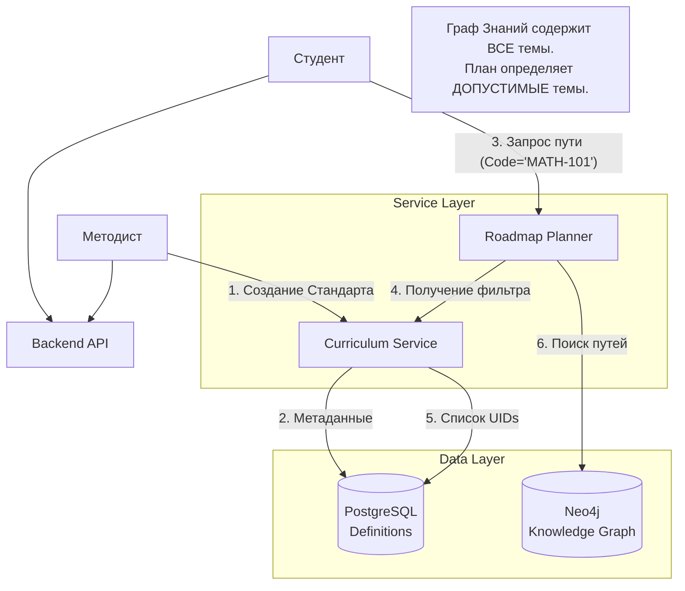

# Архитектура Управления Учебными Программами (Curriculum Management)

**Статус документа:** Release 1.0
**Аудитория:** CTO, System Architects, Lead Developers
**Область:** KnowledgeBaseAI Backend

---

## 1. Введение и Концепция

Модуль **Curriculum Management** (Управление Учебными Программами) предназначен для наложения нормативных или педагогических ограничений на глобальный Граф Знаний.

В отличие от традиционных LMS, где курс — это жесткая последовательность лекций, в KnowledgeBaseAI учебная программа (Curriculum) выступает в роли **"Призмы" (Prism)** или **Фильтра**. Она определяет *подмножество* тем из глобального графа, которые *обязательны* или *доступны* для изучения в рамках конкретного стандарта (например, ФГОС, Common Core, Корпоративный стандарт).

### Ключевые принципы:
1.  **Separation of Concerns**: Граф Знаний (Neo4j) хранит *онтологию* (что от чего зависит). Учебный план (PostgreSQL) хранит *норматив* (что нужно изучить).
2.  **Hybrid Persistence**: Метаданные планов живут в реляционной БД, контент — в графовой.
3.  **Dynamic Routing**: Путь студента (Roadmap) строится динамически внутри границ, очерченных учебным планом.

---

## 2. Архитектура Системы

### 2.1. Компоненты



### 2.2. Поток Данных (The "Prism" Logic)

Когда студент запрашивает обучение по программе `CODE`:
1.  **Fetch Definition**: Система извлекает из PostgreSQL список "корневых" тем, явно включенных в стандарт.
2.  **Graph Expansion**: В Neo4j происходит рекурсивный поиск всех *пререквизитов* для этих тем (`MATCH (t)-[:PREREQ*]->(p)`).
3.  **Intersection**: Итоговое множество `AllowedTopics = ExplicitNodes U Prerequisites`.
4.  **Personalization**: Из множества `AllowedTopics` исключаются уже освоенные студентом темы, и строится оптимальный маршрут к ближайшей цели.

---

## 3. Модель Данных (Domain Model)

### 3.1. Реляционная схема (PostgreSQL)

Хранит определения стандартов.

**Таблица `curricula`**
| Поле | Тип | Описание |
| :--- | :--- | :--- |
| `id` | UUID/Int | PK |
| `code` | String | Уникальный бизнес-код (напр., `MATH-ALGEBRA-V1`). Используется API. |
| `title` | String | Человекочитаемое название. |
| `standard` | String | Группировка (напр., `FGOS`, `COMMON_CORE`). |
| `language` | String | Язык контента (`ru`, `en`). |
| `status` | Enum | `draft`, `active`, `archived`. |

**Таблица `curriculum_nodes`**
| Поле | Тип | Описание |
| :--- | :--- | :--- |
| `curriculum_id` | FK | Ссылка на план. |
| `canonical_uid` | String | **Ключевое поле**. Ссылка на `uid` узла в Neo4j (Topic, Skill). |
| `kind` | String | Тип узла (`topic`, `skill`, `section`). |
| `is_required` | Bool | Если `true`, узел обязателен для получения сертификата. |
| `order_index` | Int | Рекомендованный порядок (мягкое ограничение для планировщика). |

### 3.2. Графовая схема (Neo4j)

Граф ничего не знает об учебных планах. Он просто хранит зависимости.
*   `Topic`: Узел знания.
*   `PREREQ`: Связь "Нельзя изучить B без A".

---

## 4. API Reference (для разработчиков)

Базовый путь: `/v1/admin/curriculum`

### 4.1. Создание Плана
`POST /`
Создает "контейнер" для стандарта.
```json
{
  "code": "PYTHON-JUNIOR",
  "title": "Python Developer (Junior)",
  "standard": "CORPORATE",
  "language": "ru"
}
```

### 4.2. Наполнение Плана
`POST /nodes`
Привязывает существующие в Графе узлы к плану.
```json
{
  "code": "PYTHON-JUNIOR",
  "nodes": [
    {
      "canonical_uid": "TOP-python-syntax",
      "kind": "topic",
      "is_required": true,
      "order_index": 10
    },
    {
      "canonical_uid": "TOP-python-loops",
      "kind": "topic",
      "is_required": true,
      "order_index": 20
    }
  ]
}
```

### 4.3. Дебаг/Просмотр
`GET /graph_view?code=PYTHON-JUNIOR`
Возвращает "плоский" список узлов, входящих в план.

---

## 5. Руководство по Созданию Программ (Workflow)

### Шаг 1: Онтологический Анализ (В Графе)
Прежде чем создавать план, убедитесь, что знания существуют в Neo4j.
1.  Загрузите контент через Ingestion API.
2.  Проверьте наличие связей `PREREQ` (без них планировщик не сможет построить путь).
3.  Получите UIDs ключевых тем (например, "Физика 7 класс" -> `SEC-physics-7`).

### Шаг 2: Регистрация Стандарта (В Postgres)
Создайте сущность Curriculum через API.
*   *Совет:* Используйте семантические коды, например `FGOS-MATH-9` или `CORP-ONBOARDING-2024`.

### Шаг 3: Маппинг (Mapping)
Сформируйте JSON со списком `canonical_uid`, которые должны войти в программу.
*   **Важно:** Не обязательно добавлять *все* мелкие темы. Достаточно добавить высокоуровневые (например, Разделы или ключевые Темы). Планировщик автоматически подтянет их зависимости.
*   *Пример:* Если вы добавите тему "Квадратные уравнения", а у нее есть пререквизит "Линейные уравнения", планировщик включит обе, даже если "Линейные" не указаны в плане явно.

### Шаг 4: Валидация
Попробуйте построить Roadmap для "чистого" пользователя:
`POST /v1/engine/roadmap` с параметром `curriculum_code`.
Убедитесь, что система выдает траекторию, ведущую к целям плана.

---

## 6. Расширенные сценарии

### 6.1. Адаптивность внутри Стандарта
Поскольку план — это лишь набор ограничений, два студента на одном плане `MATH-101` могут иметь разные траектории:
*   Студент А (знает основы): Сразу получает сложные задачи.
*   Студент Б (пробелы): Система ведет его через пререквизиты, которые *автоматически* включились в план как зависимости.

### 6.2. Версионирование
Рекомендуется включать версию в `code` (`MATH-V1`, `MATH-V2`). Изменения в `curriculum_nodes` применяются мгновенно для новых запросов Roadmap.

### 6.3. Экспорт/Импорт
Для переноса планов между средами (Dev -> Prod) используйте скрипты миграции, которые читают JSON-конфиги и вызывают API `/nodes`.
