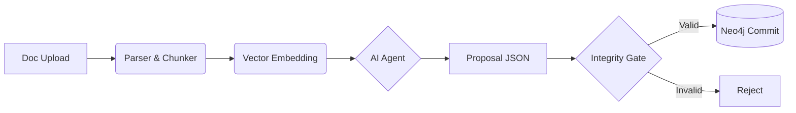

# KnowledgeBaseAI 2.0


**Cognitive Infrastructure Platform** — платформа адаптивного обучения и управления знаниями нового поколения.

В отличие от классических LMS, KnowledgeBaseAI отказывается от линейных списков контента в пользу **Направленного Графа Знаний (Knowledge Graph)**. Мы объединяем детерминированную структуру графов с семантической мощью LLM/RAG, гарантируя математическую корректность, безопасность данных и объяснимость рекомендаций.

---

## 🌟 Ключевые особенности

*   **Graph-First Architecture:** Единственным источником истины является граф (Neo4j). Векторные индексы (Qdrant) — это лишь производный кэш.
*   **Adaptive Learning Engine:** Построение нелинейных маршрутов обучения (Roadmaps) на основе алгоритма A*, учитывающего пробелы в знаниях, уверенность пользователя и сложность материала.
*   **Safety via Proposals:** Прямая запись в базу запрещена. Все изменения проходят через пайплайн: `Draft` → `Proposal` → `Validation` → `Integrity Gate` → `Commit`.
*   **Evidence-Based:** Любое знание в графе имеет ссылку на источник (цитату/чанк). Никаких галлюцинаций.
*   **Strict Tenant Isolation:** Данные разных клиентов физически и логически изолированы. Утечка данных исключена архитектурно.

---

## 🏗 Архитектура

Проект построен на принципе **"Святой Троицы Данных"** (Polyglot Persistence):

1.  **Neo4j (The Brain):** Хранит топологию знаний, онтологию (Concept, Skill, Error) и связи (`PREREQ`, `BASED_ON`).
2.  **Qdrant (The Semantic Layer):** Отвечает за векторный поиск и RAG.
3.  **PostgreSQL (The Backbone):** Хранит пользователей, метаданные Proposals, историю задач и Audit Log.

### Схема потока данных (Ingestion Pipeline)


---

## 🛠 Технический стек

*   **Backend:** Python 3.12, FastAPI (Async)
*   **Databases:** Neo4j 5.x, Qdrant, PostgreSQL 16, Redis
*   **Infrastructure:** Docker Compose, Traefik (Edge Router)
*   **AI/ML:** OpenAI/Claude API (via LangChain), Sentence-Transformers
*   **Frontend:** React, TypeScript, Vite (Optimistic UI patterns)

---

## 🚀 Быстрый старт

### Требования
*   Docker & Docker Compose
*   Python 3.12+ (для локальной разработки)
*   Make

### Установка

1.  **Клонирование репозитория:**
    ```bash
    git clone https://github.com/AndrewHakmi/KnowledgeBaseAI.git
    cd KnowledgeBaseAI
    ```

2.  **Настройка окружения:**
    Скопируйте пример конфига и заполните ключи (OpenAI, DB passwords):
    ```bash
    cp .env.example .env
    ```

3.  **Запуск инфраструктуры:**
    ```bash
    docker-compose up -d --build
    ```

4.  **Проверка статуса:**
    После запуска документация API будет доступна по адресу:
    `http://localhost:8000/docs`

---

## 🛡 Архитектурные Инварианты

Разработка ведется в строгом соответствии с **Master Design Document**. Нарушение этих правил недопустимо:

1.  **No Direct Writes:** Никакой код (кроме `Commit Worker`) не пишет `CREATE/SET` в Neo4j напрямую. Используйте `ProposalService`.
2.  **Determinism:** Одинаковый входной файл + одинаковый конфиг обязаны давать идентичный `proposal_checksum`.
3.  **Integrity Gate:** Нельзя закоммитить граф с циклами в зависимостях (`PREREQ`) или "висячими" навыками.
4.  **Tenant Isolation:** Каждый запрос к БД обязан содержать фильтр по `tenant_id`.

---

## 📂 Структура проекта

```text
KnowledgeBaseAI/
├── backend/
│   ├── app/
│   │   ├── api/            # REST Endpoints
│   │   ├── core/           # Config, Security, Math Engines
│   │   ├── db/             # DAO Layers (Neo4j, Postgres, Qdrant)
│   │   ├── services/       # Business Logic (Ingestion, Roadmap)
│   │   └── workers/        # Async Tasks (Celery/ARQ)
│   └── tests/              # Pytest (Unit & Integration)
├── frontend/               # React Application
├── infra/                  # Docker & Terraform configs
└── docs/                   # Architecture & API Specs
```

---

## 🤝 Contribution (Внутреннее использование)

1.  Все изменения проходят через Pull Requests.
2.  Изменения в онтологии требуют обновления версии схемы (`schema_version`).
3.  При добавлении новых фич обязательно покрытие тестами (`tests/`).
4.  Соблюдайте Code Style: `ruff`, `black`, `mypy`.

---

## 📄 Лицензия

Данный проект распространяется под лицензией **BUSL-1.1 (Business Source License)**.
Код доступен для изучения, но коммерческое использование ограничено условиями лицензии.
См. файл [LICENSE](LICENSE) для подробностей.

---

**KnowledgeBaseAI** — *Engineering Knowledge. Deterministically.*