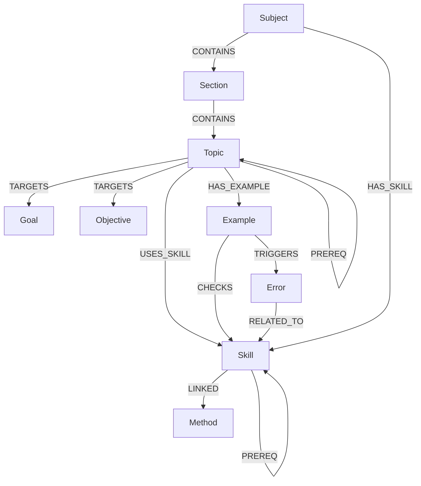

* абсолютно точные связи (где 1:N, где M:N, где ориентированные);
* формальная модель сущностей (атрибуты, роли, инварианты);
* строгие правила корректности (валидации, ограничения);
* готовые ER-диаграммы
* готовая **GRAФ-модель для Neo4j**

---

# 📘 **База знаний StudyNinja — формальная модель, связи и спецификация**

# 1. Введение

StudyNinja Knowledge Base (KB) — **единый источник истины (SSOT)** о предметной области, обеспечивающий:

* **диагностику навыков**
* **адаптивное обучение**
* **генерацию маршрутов**
* **поиск, объяснение и подбор корректирующих интервенций**

Основан на причинно-следственных отношениях:

* *«Чтобы выполнить действие A, нужно владеть навыком B»*
* *«Чтобы освоить тему T, нужно устойчиво применять σ(T) к S(T)»*

KB полностью отделена от данных учеников и используется множеством LMS как независимое ядро.

---

# 2. Нотация

* `σ(тема)` — **замкнутое множество навыков**, требуемых для освоения темы.
* `S(тема)` — **канонический класс заданий**, проверяющих тему.
* Освоение темы = устойчивое выполнение `σ(тема)` на `S(тема)` с выполнением платформенных порогов.

---

# 3. Политика идентификаторов (UID)

### Формат:

* `SUB-<ULID>` — предмет
* `SEC-<ULID>` — раздел
* `TOP-<ULID>` — тема
* `SKL-<ULID>` — навык
* `MTH-<ULID>` — метод
* `EXM-<ULID>` — пример
* `ERR-<ULID>` — ошибка

### Правила:

* UID неизменяем
* человеко-читаемый префикс
* ULID не должен кодировать смысл
* транзакционная генерация

---

# 4. Сущности (формальная модель)

Ниже — **строгое описание каждой сущности** и **её корректных связей**.

---

# 📚 4.1. Предмет (Subject)

### Атрибуты:

* `uid`
* `title`
* `description`
* `metadata` (программа, язык, уровень и т.п.)

### Роль:

Корневая сущность предметной иерархии.

### Связи:

* `Subject → Section` (1:N, строгая принадлежность)
* `Subject → Skill` (1:N, все навыки привязаны к предмету)

---

# 📘 4.2. Раздел (Section)

### Атрибуты:

* `uid`
* `subject_uid`
* `title`
* `description`

### Роль:

Логическая группировка тем.

### Связи:

* `Subject → Section` (1:N)
* `Section → Topic` (1:N)

---

# 📙 4.3. Тема (Topic)

### Атрибуты:

* `uid`
* `section_uid`
* `title`
* `description`
* `static_weight` (базовая сложность темы)
* `dynamic_weight` (адаптивный глобальный вес)
* `thresholds` (порог освоения)

### Роль:

Главная учебная единица. Тема не содержит действий — только цели и связи.

### Связи:

* `Section → Topic` (1:N)
* `Topic ↔ Skill` (M:N через `USES_SKILL`)
* `Topic → Goal` (1:N)
* `Topic → Objective` (1:N)
* `Topic → Topic` (пререквизиты, DAG)
* `Topic → Example` (фактически через JSONL; в граф может быть добавлено позже)

### Инварианты:

* Тема принадлежит ровно одному разделу
* Освоение темы определяется освоением всех навыков σ(тема)

---

# 🎯 4.4. Навык (Skill)

### Атрибуты:

* `uid`
* `subject_uid`
* `title`
* `definition`
* `type` (операционный / концептуальный / метакогнитивный)
* `static_weight`
* `dynamic_weight`
* `status` (active/archived)

### Роль:

Минимальная атомарная измеримая единица мастерства.

### Связи:

* `Subject → Skill` (1:N)
* `Topic ↔ Skill` (M:N, ключевая связь)
* `Skill ↔ Method` (M:N)
* `Skill ↔ Example` (M:N)
* `Skill ↔ Error` (M:N)

### Инварианты:

* Навык может принадлежать только одному предмету
* Навык может быть применим в нескольких темах одного предмета
* Навыки формируют собственный DAG prerequisite

---

# 🛠 4.5. Метод (Method)

### Атрибуты:

* `uid`
* `title`
* `method_text`
* `applicability_types` (tags: “equations”, “fractions”, “geometry-basic”…)
* `metadata`

### Роль:

Стратегия выполнения навыка. Используется в объяснении, пошаговом разборе, подборе следующего шага.

### Связи:

* `Skill ↔ Method` (M:N через `LINKED`)

### Инварианты:

* Метод может применяться только к тем навыкам, для которых он валиден
* Валидация типов обязательна (метод «разложение на множители» не может применяться к навыку «решение пропорций»)

---

# 📝 4.6. Пример (Example)

### Атрибуты:

* `uid`
* `topic_uid`
* `title`
* `statement`
* `difficulty` (1–5)
* `metadata` (мультимедиа, источники)

### Роль:

Минимальная единица контроля.
Проверяет один или несколько навыков.

### Связи:

* `Example ↔ Skill` (M:N)
* `Example ↔ Error` (M:N)

### Инварианты:

* Ровно одна тема (`topic_uid`)
* Полный набор целей: должен покрывать все целевые навыки темы

---

# ⚠️ 4.7. Ошибка (Error)

### Атрибуты:

* `uid`
* `title`
* `error_text`
* `triggers` (словари паттернов)
* `severity`
* `booster_refs`

### Роль:

Типовая ошибка или заблуждение — ключ к ремедиации.

### Связи:

* `Error ↔ Skill` (M:N)
* `Error ↔ Example` (M:N)

### Инварианты:

* Ошибка обязана быть привязана хотя бы к одному навыку
* Привязка к примеру опциональна, но желательна для объяснений

---

# 🎯 4.8. Цель (Goal) и Подцель (Objective)

### Goal — высокоуровневая цель темы:

* “Научиться решать линейные уравнения”

### Objective — низкоуровневый шаг:

* “Освоить перенос слагаемых”
* “Освоить деление обеих частей на коэффициент”

Связь:

* `Topic → Goal` (1:N)
* `Topic → Objective` (1:N)

---

# 5. Связи и инварианты графа (строгая модель)

Ниже — **формальная модель связей**.

---

## 5.1. Иерархия адресации

```
Subject → Section → Topic      (всегда 1:N)
```

Инварианты:

* Нельзя привязать тему к двум разделам
* Нельзя привязать раздел к двум предметам
* Иерархия не пересекается между предметами

---

## 5.2. Предметный граф навыков

```
Topic ↔ Skill       (M:N)
```

Атрибуты ребра:

* `role: core|support|context`
* `confidence: float` (0..1)
* `weight: enum` (позиционная важность)

Инварианты:

* Каждая тема должна иметь ≥1 «core» навык
* Навык может находиться в нескольких темах, но только одного предмета
* Через эту связь строится σ(тема)

---

## 5.3. Связи навыков и методов

```
Skill ↔ Method      (M:N)
```

Атрибуты ребра:

* `weight: enum`
* `confidence: float`
* `adaptive_weight: float` (для адаптивного выбора)

Инварианты:

* Тип метода должен соответствовать типу навыка
* `adaptive_weight` пересчитывается из динамики навыков

---

## 5.4. Примеры

```
Example → Topic (1:N)
Example ↔ Skill (M:N)
Example ↔ Error (M:N)
```

Инварианты:

* Пример должен иметь ровно одну тему
* Хотя бы один целевой навык

---

## 5.5. Ошибки

```
Error ↔ Skill     (M:N)
Error ↔ Example   (M:N)
```

Инварианты:

* Ошибка должна быть привязана к навыку
* Опциональная привязка к примеру усиливает диагностическую точность

---

## 5.6. Пререквизиты (Prerequisite)

```
Topic → Topic      (ориентированный граф без циклов)
Skill → Skill      (ориентированный граф без циклов)
```

Инварианты:

* Граф **должен быть DAG**
* Перед добавлением ребра выполняется DFS / топологическая проверка
* Нельзя создать:

  * цикл
  * ребро между различными предметами
  * ребро между классами «вперёд» (7 класс → 5 класс)

---

# 6. Диаграмма (полная модель графа)



---

# 7. Диагностика (OLTP-модель)

(хранится вне БЗ, но использует сущности БЗ)

* `Attempt(example_uid, user_id, timestamp…)`
* `SkillEvaluation(skill_uid, score, role)`
* `ErrorEvent(error_uid, severity, trigger)`

Инвариант:

* Диагностика **не изменяет БЗ** — только использует её как источник структуры.

---

# 8. Адаптация

На входе:

* веса навыков
* DAG
* сложность примеров
* σ(тема)

Система определяет:

* следующее задание
* корректирующий метод
* бустер КОРРЕКТНОЙ гранулярности

Ни одна персонализация **не изменяет структуру БЗ**, только интерпретирует её.

---

# 9. Управление качеством данных

Проверки:

* уникальность UID
* внешние ключи
* валидность типов методов
* роли в пример↔навык
* DAG-проверки темы и навыков
* полнота покрытия примерами σ(тема)

---

# 10. Границы модели

База знаний **НЕ хранит**:

* прогресс пользователя
* веса пользователя
* историю попыток
* классы, группы, учителей

БЗ — **универсальная надёжная структура**, а персонализация лежит *внешним слоем*.