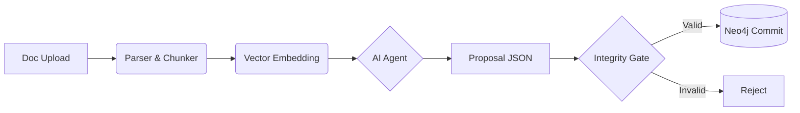

# Итоговое техническое резюме — KnowledgeBaseAI

## Назначение проекта

KnowledgeBaseAI — серверная платформа для управления графовой моделью знаний и сервис генерации учебного контента. Система предоставляет API для интеграции с LMS, инструменты для администрирования и инструменты для внесения изменений в граф знаний. Основные сценарии: построение дорожных карт обучения, адаптивный подбор вопросов, аналитика качества контента и генерация материалов с помощью LLM.

## Целевая аудитория

- Разработчики и интеграторы LMS, использующие API для построения образовательных сценариев.
- Администраторы и авторы контента, управляющие графом и проверяющие заявки.
- Косвенно — конечные пользователи, получающие адаптивный контент через интегрированные клиенты.

## Архитектура и основные компоненты

Проект построен на принципе **"Святой Троицы Данных"** (Polyglot Persistence):

1.  **Neo4j (The Brain):** Хранит топологию знаний, онтологию (Concept, Skill, Error) и связи (`PREREQ`, `BASED_ON`).
2.  **Qdrant (The Semantic Layer):** Отвечает за векторный поиск и RAG.
3.  **PostgreSQL (The Backbone):** Хранит пользователей, метаданные Proposals, историю задач и Audit Log.

### Схема потока данных (Ingestion Pipeline)

Проект очевидно разделен на несколько слоев, четко выделяя доступ к данным, бизнес-логики. Модульность проявляется в структуре папок, а сервисный характер в асинхроном подходе.

## Технологический стек

Backend: Python 3.12, FastAPI (Async)
Databases: Neo4j 5.x, Qdrant, PostgreSQL 16, Redis
Infrastructure: Docker Compose, Traefik (Edge Router)
AI/ML: OpenAI/Claude API (via LangChain), Sentence-Transformers

## Код и структура проекта

Код на протяжении проекта часто меняет свою идентичность: описание функций то на английском, то на русском. Часто встречается не соответсвие PEP8. 
Чрезмерное количество try except, finally. В ошибках также не хватает уточняющих элементов. Частое повторений обработок ошибок, например в `errors.py` описано возвращение ошибки в виде json, в дальнейшем это игнорируется и обрабатывается `ApiError`. 
Также использования голых запросов вместо ORM режит глаз, хотя и понимаю, что это требования к скорости обработки проекта. 
Также используется в одном файле и создание таблиц, и эндпоинты, что для меня лично выглядит непонятно и стилистически неверным.

Репозиторий организован по слоям и областям ответственности: `src/api` (контроллеры и роутеры), `src/services` (бизнес-логика), `src/core` (утилиты, контекст, логирование), `src/config` (настройки) и `src/workers` (фоновые задачи).

Ядро логики сосредоточено в `src/services` и включает ключевые подсистемы:

- `src/services/graph/` — `graph_service.py`, `neo4j_repo.py`, `neo4j_writer.py`: доменные операции с графом знаний, транзакции и обеспечение целостности данных.
- `src/services/proposal_service.py`, `src/services/diff.py`, `src/services/rebase.py` — валидация, ревью, создание чек-сумм и применение изменений в граф.
- `src/services/kb/` — сборка и импорт/экспорт знаний (`builder.py`, `jsonl_io.py`).
- `src/services/vector/` и `src/services/embeddings/` — генерация эмбеддингов, синхронизация и поиск в Qdrant.
- `src/services/roadmap_planner.py` и `src/services/questions.py` — логика построения дорожных карт и селектора адаптивных вопросов.
- Фоновые задачи и задания: `src/workers/*` и `src/services/jobs/*` — асинхронная обработка долгих задач (rebuild, vector_sync, outbox publishing).

## Качество и зрелость

- Документация: `README.md` и `backend/README.md` с инструкциями по запуску и деплою.
- Есть, в папке `tests/` используется `pytest`, проверяется целостность графа, векторная логика, эндпоинты и утилиты.
- Обработка ошибок: централизованные обработчики в `main.py` возвращают `ApiError`. Однако в коде встречаются подавляющие блоки исключений, требующие уточнения логирования.
- Масштабируемость: архитектура учитывает горизонтальное масштабирование фоновых задач.

